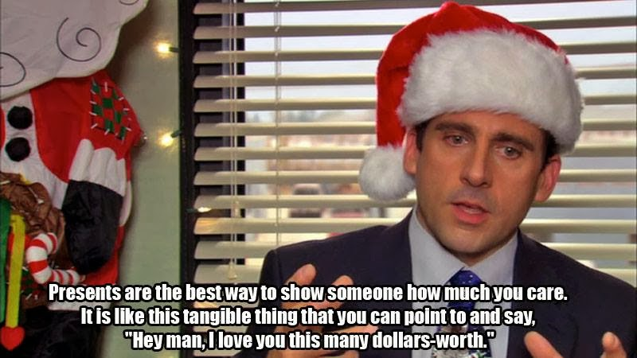

[Blog](https://cameronntaylor.github.io/blog/) | [My Personal Website](https://cameronntaylor.github.io/)

This series of posts explores interesting and simple economic ideas as displayed by the TV show The Office. As a big fan I found many interesting ideas in The Office that, while often silly, actually do contain economic insight. Each post will be organized around one video clip and an economic theme. Each post will try to explore the idea succintly but in depth, including what the modern research literature has to say. Another excellent website that does something similar to mine is [http://economicsoftheoffice.com/](http://economicsoftheoffice.com/) which posts video clips of the office with relevant classifications and short descriptions on what economic concept is being portrayed.

Season: 2 
Episode: 10
Minute: 06:50

[Video Link (Youtube)](https://www.youtube.com/watch?v=B6jCMaiTqG0)

Quote: *“Presents are the best way to show someone how much you care. It is like this tangible thing you can point to and say, `Hey man, I love you this many dollars worth’.” - Michael on Secret Santa and presents.*  

Economic concept: Signaling. 

Michael says that presents are a way for people to express how much they value each other. In economic theory, one way to justify people giving gifts is that they derive happiness or value from other’s happiness. For example, economists might say that the relationship between your happiness and stuff is 

*Your happiness = stuff you own + b x (stuff your friends and family own)*

where 0<b<1 that measures the altruistic weight on your friends and family. If b=1 then you care about your families well-being as much as your own while if b=0 you don’t care at all about your friends and family. It is entirely possible that people have different b’s for different people. For example, there is a large economics research literature that looks at the implications of parent's altruism towards their children for investing in children's education and well-being. However, in the context that Michael is discussing, the social setting is one more with friends or even acquantainces.  

Michael's quote highlights that gifts help provide information about your preferences in such settings. It is often useful to give information about your preferences (or other unobservable qualities) to others by taking certain actions, what economists call *signalinng*. In this case, the problem that you face is that other people cannot see your own b. 

Buying a gift provides a way to concretely signal your value of b to others. In general, if b is larger, you will buy a more expensive gift, or a gift that requires more effort. There are, of course, other factors that affect the size of gift. But, holding those factors constant, this prediction is quite robust in these types of economic models.  

Thus, Michael Scott is right: the cost of the gift says something about your preferences!
